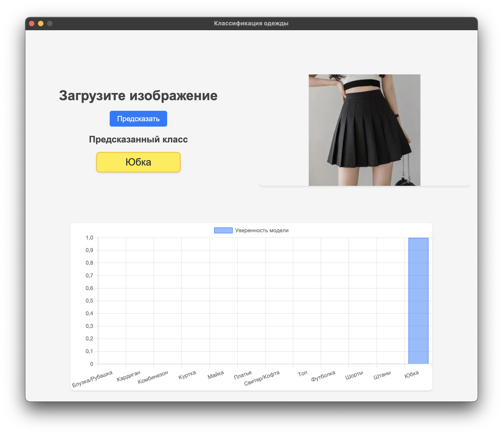

# Clothes Classification
This **Electron** application uses my trained `ResNet50` model to classify **12 categories** of clothing in the images




## Quick start
Download the project
```bash
git clone git@github.com:razveetonormalno/clothes-classification-electron-app.git clothes-classification
cd clothes-classification
```

Create a virtual environment, activate it and then:
```
pip install -r requirements.txt
pyinstaller --onefile backend/predict.py
pyinstaller --onefile backend/server.py

npm init -y
npm install electron --save-dev
npm start
```
